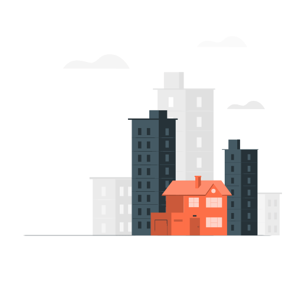

# resumo-http
Este resumo foi baseado em:

1. Curso Alura _"HTTP: Entendendo a web por baixo dos panos"_;
2. 

| Assuntos abordados no resumo                                 |
| ------------------------------------------------------------ |
| O que é HTTP;                                                |
| Como funciona o transporte seguro de informações na web;     |
| Endereços e sua composição: protocolo, domínio, porta e recurso; |
| A relação entre domínio de um site e seu endereço de IP;     |
|                                                              |
|                                                              |
|                                                              |
|                                                              |
|                                                              |


## Sumário

- [Introdução](#Introdução)
- [O que é HTTP](#O-que-é-HTTP)

  - [Exemplo prático de como funciona o HTTP](#Exemplo-prático-de-como-funciona-o-HTTP)

  - [HTTP e HTTPS](#HTTP-e-HTTPS) 
    - [Como funciona a comunicação segura](#Como-funciona-a-comunicação-segura)
      - [Comunicação segura via criptografia assimétrica](#Comunicação-segura-via-criptografia-assimétrica)
      - [Comunicação segura via criptografia híbrida](#Comunicação-segura-via-criptografia-híbrida)
-  [Endereços web](#Endereços-web)
  - [Composição dos endereços web](#Composição-dos-endereços-web)
    - Protocolo
    - Domínio
      - Subdomínio
      - TLD
      - Raiz
    - Porta
    - Recurso
  - [Portas](#Portas)
  - [Recursos](#Recursos)
- [Requisições HTTP](#Requisições-HTTP)
- 

## O que é HTTP
> Curso da Alura </br>*HTTP - Entendendo a Internet Por Baixo dos Panos: Aula 01*

O **HTTP** (*Hypertext Transfer Protocol*) é um canal de comunicação que une o **cliente** - quem recebe o conteúdo - e o **servidor** - quem envia o conteúdo.  Sendo assim, ele funciona no **Modelo Cliente-Servidor**, estabelecendo um conjunto de regras para que esta ligação aconteça.

Observações importantes:

- As regras de comunicação HTTP estão disponíveis no [RFC¹ HTTP](https://tools.ietf.org/html/rfc2616), mantido pela [The Internet Society](https://www.internetsociety.org/) e pela [Internet Engineering Task Force](https://www.ietf.org/).
- HTTP é independente da plataforma de desenvolvimento, sendo aplicável em .Net, PHP, Java, entre outros. 

- Assim como o HTTP, existem outros protocolos de comunicação. Alguns exemplos são FTP, BitTorrent e SMTP.
- Existem outros modelos de comunicação além do "cliente-servidor", como o P2P, ou Peer-To-Peer. 

### Exemplo prático de como funciona o HTTP 

Exemplo do site Alura:

1. O cliente (navegador) faz uma requisição via HTTP;
2. A requisição vai para o servidor (tomcat);
3. O servidor solicita ao banco de dados (MySQL) o conteúdo pedido;
4. O banco de dados responde ao servidor;
5. O servidor devolve uma resposta ao cliente.

```js
Cliente  <-- HTTP --> Servidor Java  <---- SQL ----> Banco de dados
chrome   protocolo de    tomcat       linguagem para      MySQL
         comunicação                se conectar com o
                                      banco de dados
```

### HTTP e HTTPS
> Curso da Alura </br>*HTTP - Entendendo a Internet Por Baixo dos Panos: Aula 02*

O conteúdo do usuário que é transmitido via requisições http trafega como texto puro  por todos os intervalos (modem, roteador, provedor) até chegar no servidor. Se o site acessado for apenas "http" e houver uma solicitação de login e senha, por exemplo, esses dados pessoais trafegarão até o servidor como um texto exposto. Isso pode ser perigoso se for interceptado por um invasor! 

Como solução, foi criado o HTTPS - *Hypertext Transfer Protocol Secure*, que usa **criptografia para conectar cliente e servidor**.

O protocolo HTTPS nada mais é do que o protocolo HTTP com uma camada adicional de segurança, a camada TLS (*Transport Layer Security*) ou seu antecessor SSL (*Secure Sockets Layer*). Ambos são protocolos também, mas de segurança.


#### Como funciona a comunicação segura

Para fazer a segurança acontecer, precisamos de alguns ajudantes:

1. Autoridade certificadora: é uma empresa que confirma que aquele site é realmente seguro, concedendo para ele um certificado digital.
2. Certificado digital: é o documento cedido pela autoridade certificadora. É nele onde está a chave pública. É possível ver o certificado dos sites e suas informações no navegador, em `Inspecionar > Security`. 
3. Chave pública: É uma sequência de números e letras que vai criptografar todos os dados que saem do cliente (navegador). Ela é ligada matematicamente com outra chave bem maior, a chave privada.
4. Chave privada: É uma outra sequência de números e letras que fica no servidor. É ela quem vai descriptografar as informações criptografadas que o cliente mandou. Só funciona com a chave pública certa. Não esqueça: elas são ligadas matematicamente.

##### Comunicação segura via criptografia assimétrica

- Cliente acessa a aplicação (site) segura;
- O cliente recebe seu certificado contendo a chave pública.
- O cliente gera o conteúdo e criptografa com a chave pública;
- O conteúdo trafega via https;
- Conteúdo chega ao servidor;
- Conteúdo é descriptografado pela chave privada que já estava no servidor.

Mas há um problema na comunicação assimétrica: é lenta! Para mudar este quadro, as duas chaves teriam que ser iguais, o que torna a transação insegura, pois quem tiver a chave pública, tem também a chave privada, certo?

Pensando nisso, a solução foi juntar as criptografias assimétrica e simétrica!

##### Comunicação segura via criptografia híbrida

- Cliente acessa a aplicação (site) segura;
- O cliente recebe seu certificado contendo a chave pública.
- O cliente gera duas chaves simétricas e criptografa uma delas com a chave pública;
- A chave simétrica criptografada trafega via https;
- A chave chega ao servidor;
- A chave (que é igual àquela que já está no cliente) é descriptografada pela chave privada que já estava no servidor.
- Essas duas chaves simétricas serão usadas para todas as requisições seguintes, com os dados criptografados normalmente.

## Endereços Web

### Composição dos endereços web

```js
<---------------------------------ENDEREÇO ou URL-------------------------------->
    https:  // www.alura         .com        .br     	:80   	/curso-front-end.html

<-protocolo-> <--------------domínio--------------><--porta--><------recurso----->
              <--domínio---><-subdomínios-><-raiz->
    								<-T.L.D.->

*U.R.L.: Uniform Resource Locator
*T.L.D.: Top Level Domain
*www também é como se fosse um subdomínio, que já está legado, mas que continuamos usando. 
```

💡 Para saber mais:  Toda URL é uma URI - *Uniform Resource Identifier*. URL é apenas uma das formas de identificar alguma coisa, aqui é feito via "endereço". Outra forma é identificar via nome e, neste caso, usamos uma URN - *Uniform Resource Name*. 

A transformação de URL para URI seria:

 `cursos.alura/course/introducao-html-css` -> *`urn:cursos:alura:course:introducao-html-css`*

#### Protocolo

É quem faz a comunicação do cliente com o servidor.

#### Domínio

É o nome do site, como globo.com ou google.com.

##### Subdomínio

##### TLD

##### Raiz

##### O Servidor DNS

Todo domínio, na verdade, é um IP mascarado. Um número de identificação complicado que leva o cliente para vários servidores espalhados pelo mundo, e estes servidores são identificados por números. O cliente **precisa** desse número para chegar no site que você quer.

Mas, por outro lado, imagina quão difícil seria decorar números como 172.217.29.46 e 69.171.250.35 apenas para dois sites: google.com e facebook.com...

Para atender a necessidade do cliente (receber um número de IP certo) e da usuária (não precisar decorar todos os IP's), temos o **servidor DNS**, Domain Name System, ou sistema de nomes de domínios.

É ele o responsável por *traduzir o domínio digitado pela usuária para o número certo do endereço IP*. Assim, o _facebook.com_ digitado é transformado em _69.171.250.35_ para que a requisição comece.

💡 Para saber mais: Para conhecer o endereçamento IP de um site, abra o prompt de comando e digite `nslookup <domínio pesquisado>`. Você vai receber uma sequência de números única para cada site.

#### Porta

Para haver a comunicação entre o cliente e o servidor, o endereço não é o suficiente. É importante que haja um lugar comum a eles para receber a requisição e para mandar a resposta. Este lugar é a **porta**.

Fazendo uma analogia, imagine que você vai visitar uma amiga. Ela te passou apenas o endereço do prédio onde mora, mas, para entrar no prédio, você precisa informar qual apartamento quer visitar. Bem... você não vai entrar lá a menos que tenha o número certo.



Neste exemplo, o prédio é o servidor e o número do apartamento é o número da porta. Só dá para acessar o servidor com essas duas informações. É assim que a **os protocolos que estão na camada de transporte** funcionam: precisamos do endereço **e** da porta.

O endereço do exemplo acima é, por baixo dos panos, `https://www.github.com:443`. 443 é a porta padrão para qualquer site https, então não precisamos digitá-la todas as vezes. Para sites http, sem a camada de segurança, a porta padrão é a 80. 

💡 Para saber mais: 

- Neste [link](https://pt.wikipedia.org/wiki/Lista_de_portas_dos_protocolos_TCP_e_UDP) estão todas as portas disponíveis para usarmos na comunicação entre um ponto e outro.

- O HTTP está na **camada de aplicação** dos protocolos de comunicação, ligando processo-a-processo. E ele usa o TCP (*Transmission Control Protocol*) e UDP (*User Datagram Protocol*), que estão numa camada abaixo, a camada de transporte. 

- Todos esses protocolos estão dentro de uma grande lista de protocolos muito úteis para a comunicação entre máquinas: a pilha de protocolos TCP/IP.

#### Recurso

Os sites geralmente não tem apenas a página inicial. Possuem mais páginas internas, recursos de busca, etc. Como acessar?

Para ter acesso a essas páginas dentro de um site, digitamos mais termos depois da barra de endereço. Exemplo: para minha página no `github.com`, o endereço completo é `github.com/marianavns`. 

O que vem depois da `/`, da **raiz**, é chamado de **recurso** e traz todas as outras páginas dentro do site!

## Requisições HTTP

Fazer uma requisição HTTP é pedir algo ao servidor através do cliente. Quando um usuário digita algum endereço no navegador, ele está fazendo uma requisição via http para acessar aquele site. Quando faz o login e senha no site da faculdade, por exemplo, ele faz a requisição de uma autorização para visualizar o conteúdo das aulas.

### Requisições HTTP são Stateless

A cada requisição, novas informações são enviadas, uma coisa de cada vez. É como enviar cartas: o texto é escrito e enviado pelos Correios e, se tiver alguma outra novidade para contar na carta, não tem como editar - precisa escrever e enviar outra vez para o mesmo destinatário. Vai ver que é por isso que estamos usando tanto o Telegram, certo?

Mas por que adicionamos itens no carrinho do Mercado Livre, fechamos a página e, no dia seguinte, o carrinho ainda está com os itens do dia anterior? A requisição não teria que ser feita outra vez?

É aí que chegamos nos conceitos de sessão e cookies.

### Sessão

Se o carrinho do Mercado Livre não esvaziou de um dia para o outro, quer dizer que o usuário ainda está na mesma **sessão**: tempo logado em uma aplicação. 

Ao fazer o primeiro acesso, são informados e-mail e senha, então o site devolve ao cliente um **token**. A cada nova requisição, como adicionar mais um item no carrinho, o usuário não precisa informar e-mail e senha mais uma vez: o cliente usa o token que já foi informado pelo servidor no primeiro acesso. Este token, junto com muitas outras informações pessoais, fica armazenado num cookie.

#### Cookie

É um arquivo de internet que armazena temporariamente o que o internauta está visitando na rede e outras informações que variam de acordo com cada aplicação, inclusive o token. Assim, o usuário se mantem na sessão, não precisa logar toda hora e não perde os itens selecionados para a compra. 

Ele garante a persistência dos dados e a manutenção do estado. Nada mais é do que um pequeno arquivo de texto armazenado na máquina do usuário.

Ele sempre fica associado a um único domínio, e um domínio pode ter vários cookies para o mesmo usuário.

💡 Para saber mais:  Para visualizar os cookies de um site no Chrome, é este o caminho: **Configurações -> Privacidade -> Configurações de conteúdo... -> Todos os cookies e dados de site... -> Pesquisar o site**


¹ RFC significa *Request For Comments* e são documentos técnicos criados por pessoas e organizações que trabalham com tecnologia. Tem diferentes fontes, desde organizações como IETF ([Internet Engineering Taskforce](https://pt.wikipedia.org/wiki/Internet_Engineering_Task_Force)), IRTF ([Internet Research Taskforce](https://pt.wikipedia.org/wiki/Internet_Research_Task_Force)), ou IAB([Internet Architechture Board](https://pt.wikipedia.org/w/index.php?title=Internet_Architechture_Board&action=edit&redlink=1)), até autores sem vínculos. 


